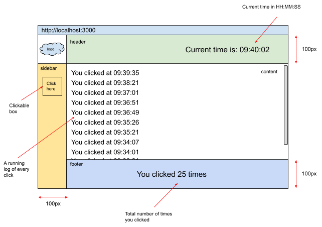
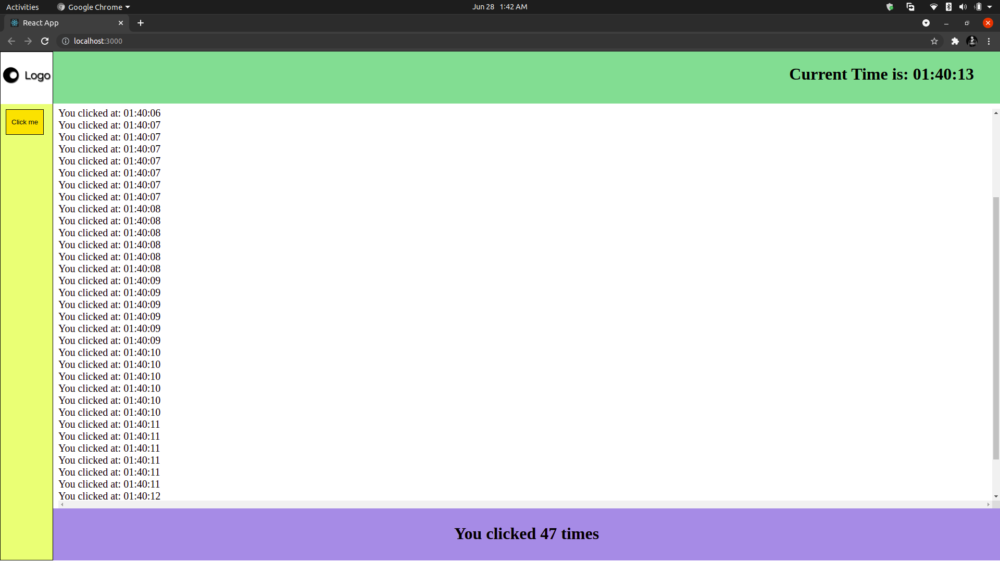
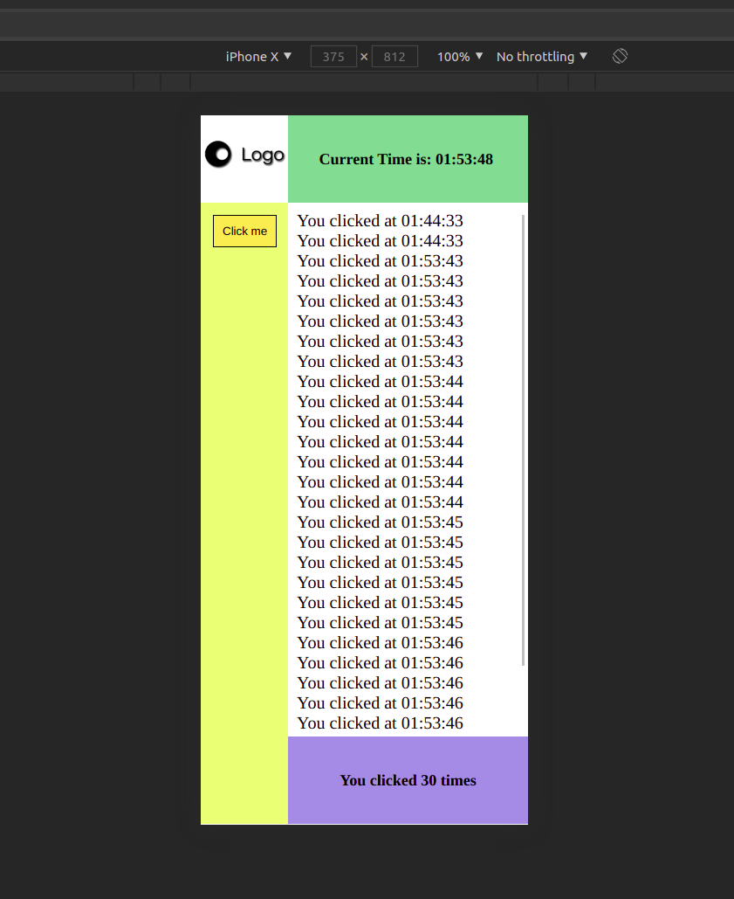

## React Interview Assignment - A One Page App

Your React application must have the following components:

- App - the wrapper component
- Logo - any logo image from internet
- SideBar - Has the ‘Click here’ box / button
- Header - Shows the current time
- Content - A running log of every click. Scrollable as the number of logs increases.
- Footer - Show the count of clicks

Recommended:

- Match as much as possible in details with the wireframe above
- React Hooks API
- React Context or Redux for state management
- CSS Flex Layout
- Responsive

#### See Live Site: <https://assignment-one-page-app.netlify.app/>

