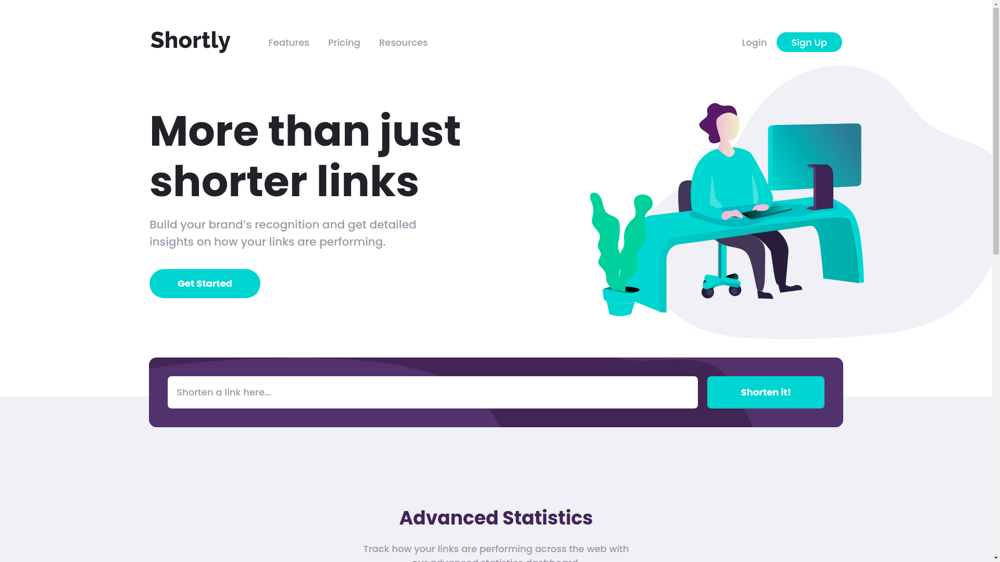
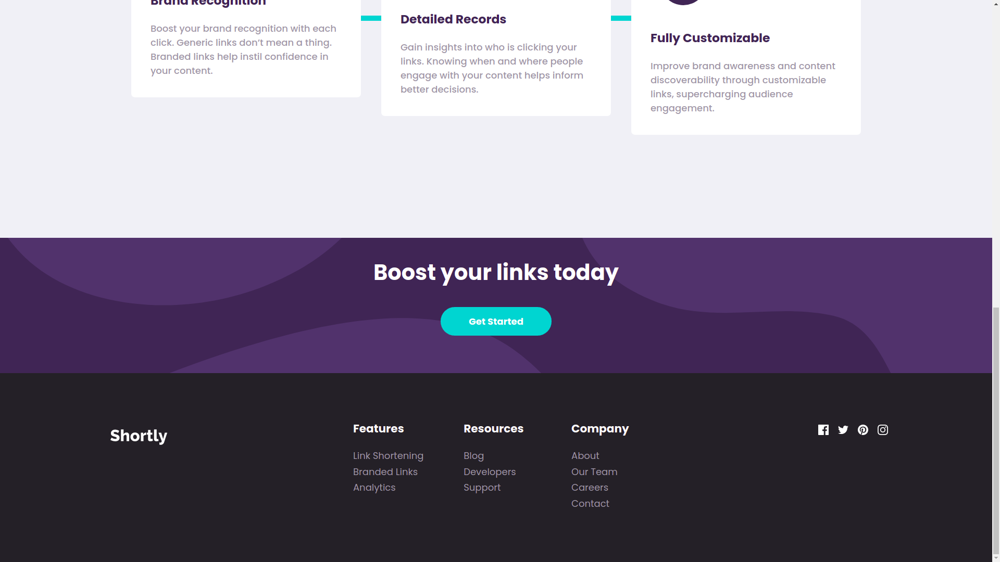
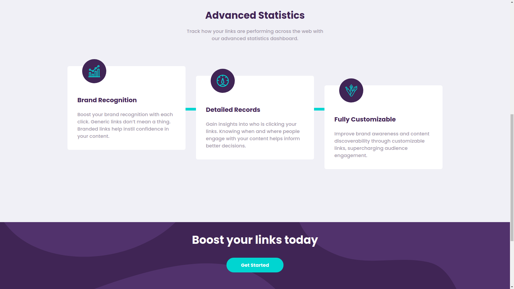
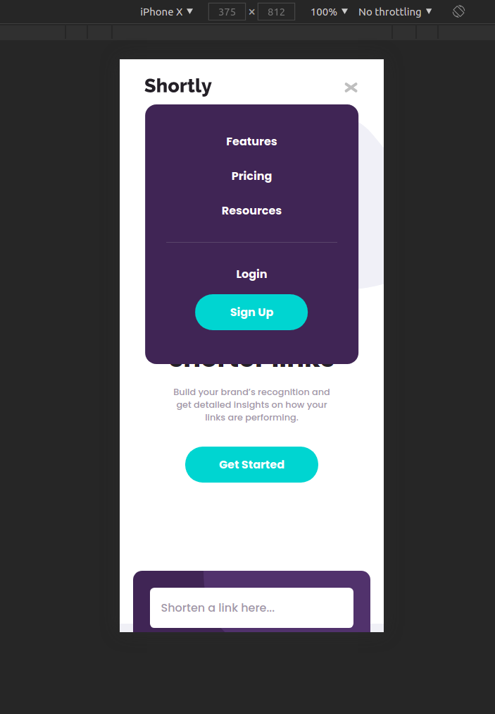
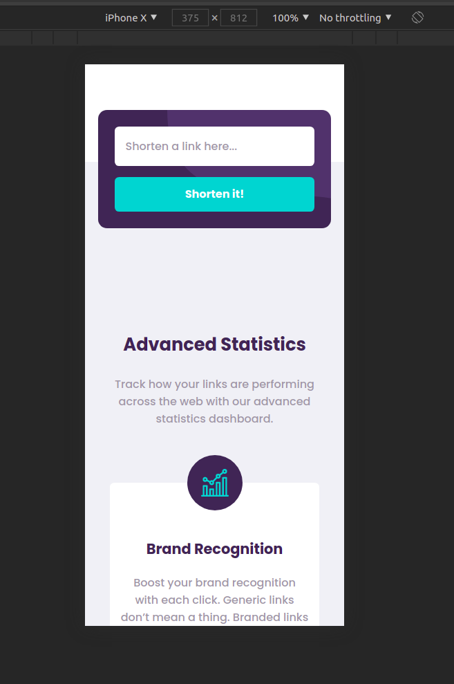
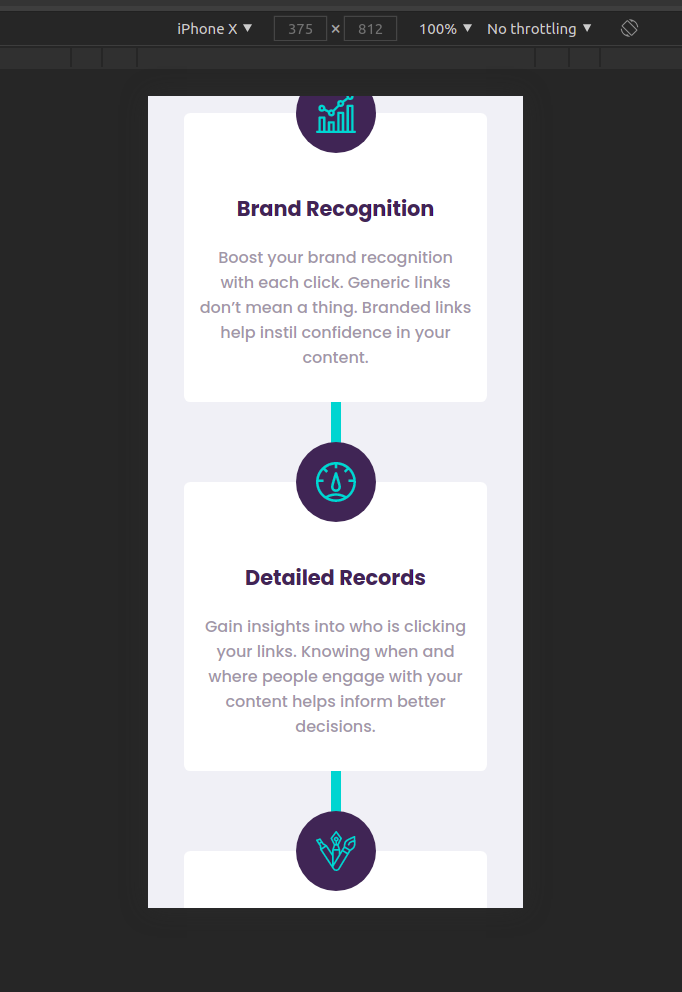
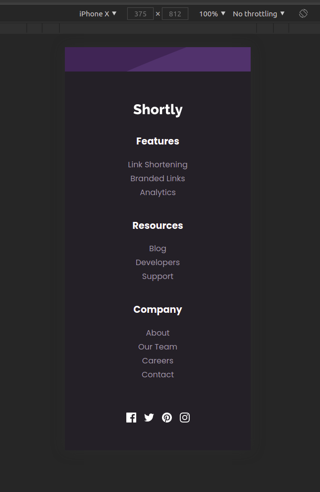

## React Assignment by The Internet Folks - Shortly Landing Page

Style Guide
Layout

The designs were created to the following widths:

- Mobile: 375px
- Desktop: 1440px
  Colors
  Primary
- Cyan: #2acfcf
- Dark Violet: #3b3054
  Secondary
- Red: #f46262
  Neutral
- Gray: #bfbfbf
- Grayish Violet: #9e9aa7
- Very Dark Blue: #35323e
- Very Dark Violet: #232127
  Typography
  Body Copy
- Font size: 18px
  Fonts
- Family: Poppins (https://fonts.google.com/specimen/Poppins)
- Weights: 500, 700

Images and Designs
Consists of the page designs that you need to follow, and the logos and background images (assets).
https://bit.ly/tif-react-assignment-assets

Shrtcode API
https://app.shrtco.de/docs

#### See Live Site: <https://shortlybyck.netlify.app/>

